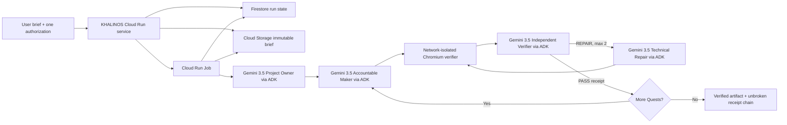

# KHALINOS

KHALINOS turns one approved product brief into a verified browser micro-application without step-by-step human guidance. A Gemini Project Owner issues an incremental Quest chain; separate Maker, Verifier, and Technical Repair agents execute it. A Quest advances only after an isolated Chromium run and an independent verification receipt both pass.

This project targets the **Taskmaster** category of the All Things Agentic Hackathon.

## The friction

Long-running coding agents often fail in one of two ways: they improvise beyond the user's authority, or they repeatedly patch the latest symptom without preserving a verified state. Human supervision then becomes the real workflow engine.

KHALINOS replaces conversational handoffs with an immutable brief, receipt-gated Quests, bounded repair, and a final evidence chain. After the user submits the brief, the Cloud workflow completes or stops safely without a coding assistant designing, fixing, or approving intermediate work.

## Google technology

- **Gemini 3.5 Flash on Vertex AI** performs Project Owner, Maker, independent Verifier, and Technical Repair decisions.
- **Google Agent Development Kit 2.6.2** runs every role as a schema-bound `LlmAgent`.
- **Cloud Run service** accepts an immutable brief and displays live status.
- **Cloud Run Job** performs the asynchronous long-running workflow.
- **Firestore** stores the current run projection.
- **Cloud Storage** stores immutable briefs, candidates, screenshots, Quest receipts, and the final manifest.

## Architecture



## Safety and autonomy contract

- The user authorizes one fixed five-file output surface and hard Quest/repair limits.
- Generated products cannot use external URLs, network calls, dynamic code loading, or additional files.
- Browser verification blocks every request except the local isolated product server.
- The Maker cannot approve its own work.
- The Verifier cannot modify the artifact.
- A failed Quest receives at most two Technical Repair rounds and then stops as `blocked`.
- No previous PASS receipt is rewritten or silently weakened.

## Local setup

Requirements: Python 3.12+, a local Chromium or Chrome executable, and Google Cloud Application Default Credentials with Vertex AI access.

```powershell
python -m venv .venv
.\.venv\Scripts\python.exe -m pip install -e ".[dev]"
$env:GOOGLE_GENAI_USE_VERTEXAI="TRUE"
$env:GOOGLE_CLOUD_PROJECT="YOUR_PROJECT_ID"
$env:GOOGLE_CLOUD_LOCATION="global"
$env:KHALINOS_CHROMIUM_PATH="C:\Program Files\Google\Chrome\Application\chrome.exe"
.\.venv\Scripts\python.exe -m pytest -q
```

The production API requires Firestore, a Cloud Storage bucket, and a fixed Cloud Run Job. For local workflow tests, the test suite uses an isolated filesystem store and fake role implementations; it never calls Vertex AI.

## Google Cloud deployment

Set a unique project and bucket name, then enable the required services:

```powershell
$env:KHALINOS_PROJECT="YOUR_PROJECT_ID"
$env:KHALINOS_REGION="asia-northeast3"
$env:KHALINOS_BUCKET="$env:KHALINOS_PROJECT-runs"
$env:KHALINOS_IMAGE="$env:KHALINOS_REGION-docker.pkg.dev/$env:KHALINOS_PROJECT/khalinos/runtime:0.1.0"

gcloud services enable run.googleapis.com cloudbuild.googleapis.com artifactregistry.googleapis.com aiplatform.googleapis.com firestore.googleapis.com storage.googleapis.com --project=$env:KHALINOS_PROJECT
gcloud artifacts repositories create khalinos --repository-format=docker --location=$env:KHALINOS_REGION --project=$env:KHALINOS_PROJECT
gcloud storage buckets create "gs://$env:KHALINOS_BUCKET" --project=$env:KHALINOS_PROJECT --location=$env:KHALINOS_REGION --uniform-bucket-level-access
gcloud firestore databases create --project=$env:KHALINOS_PROJECT --location=$env:KHALINOS_REGION --type=firestore-native
```

Create separate service identities:

```powershell
gcloud iam service-accounts create khalinos-api --project=$env:KHALINOS_PROJECT
gcloud iam service-accounts create khalinos-worker --project=$env:KHALINOS_PROJECT

$api="khalinos-api@$env:KHALINOS_PROJECT.iam.gserviceaccount.com"
$worker="khalinos-worker@$env:KHALINOS_PROJECT.iam.gserviceaccount.com"

gcloud projects add-iam-policy-binding $env:KHALINOS_PROJECT --member="serviceAccount:$api" --role="roles/datastore.user"
gcloud projects add-iam-policy-binding $env:KHALINOS_PROJECT --member="serviceAccount:$api" --role="roles/storage.objectAdmin"
gcloud projects add-iam-policy-binding $env:KHALINOS_PROJECT --member="serviceAccount:$api" --role="roles/run.developer"
gcloud projects add-iam-policy-binding $env:KHALINOS_PROJECT --member="serviceAccount:$worker" --role="roles/datastore.user"
gcloud projects add-iam-policy-binding $env:KHALINOS_PROJECT --member="serviceAccount:$worker" --role="roles/storage.objectAdmin"
gcloud projects add-iam-policy-binding $env:KHALINOS_PROJECT --member="serviceAccount:$worker" --role="roles/aiplatform.user"
```

Build and deploy:

```powershell
gcloud builds submit --project=$env:KHALINOS_PROJECT --tag=$env:KHALINOS_IMAGE

gcloud run jobs deploy khalinos-worker --project=$env:KHALINOS_PROJECT --region=$env:KHALINOS_REGION --image=$env:KHALINOS_IMAGE --service-account=$worker --command=python --args="-m" --args="khalinos.worker" --set-env-vars="GOOGLE_CLOUD_PROJECT=$env:KHALINOS_PROJECT,GOOGLE_CLOUD_LOCATION=global,GOOGLE_GENAI_USE_VERTEXAI=TRUE,KHALINOS_BUCKET=$env:KHALINOS_BUCKET,KHALINOS_MODEL=gemini-3.5-flash" --task-timeout=1800 --max-retries=0 --memory=2Gi --cpu=2

gcloud run deploy khalinos --project=$env:KHALINOS_PROJECT --region=$env:KHALINOS_REGION --image=$env:KHALINOS_IMAGE --service-account=$api --set-env-vars="GOOGLE_CLOUD_PROJECT=$env:KHALINOS_PROJECT,KHALINOS_REGION=$env:KHALINOS_REGION,KHALINOS_BUCKET=$env:KHALINOS_BUCKET,KHALINOS_WORKER_JOB=khalinos-worker,KHALINOS_MODEL=gemini-3.5-flash" --min=0 --max=2 --memory=512Mi --cpu=1 --allow-unauthenticated
```

Grant the API identity permission to run the fixed worker Job and act as its identity using the narrowest organization policy available. Verify the deployed `/health` response, submit one brief through the UI, and observe the Cloud Run execution, Vertex AI calls, Firestore state changes, Cloud Storage evidence, and final receipt chain.

## Reproducible proof checklist

1. Show the public Cloud Run URL and `/health` response.
2. Submit one brief and do not edit the run afterward.
3. Show the asynchronous Cloud Run Job execution.
4. Show Vertex AI/Cloud logs for the four ADK roles.
5. Show Firestore advancing through planning, execution, verification, and repair if needed.
6. Show Cloud Storage screenshots and every Quest receipt.
7. Open the final generated application and its final manifest.

## Verified Google Cloud run

The repository includes evidence from a fresh autonomous run made after deployment:

- Run ID: `5fc00dc96e0a41cd8df713c58eb06678`
- Immutable brief SHA-256: `86c29a41b04fcdbaec6aa3452f3ccd0b5a361e9346a83915b09ee4b6a9fc95d8`
- Worker image digest: `sha256:89f47eecede50ac291aa96d7c272d7652a85eedb960d05336d49afcf72cbf429`
- Result: 3 of 3 receipt-gated Quests passed, 0 repair rounds, 7 Gemini calls
- Cloud Run Job execution: `khalinos-worker-7nwtm`, completed successfully in 2m 4.72s


The machine-readable Quest plan, receipts, and final manifest are in [`docs/evidence`](docs/evidence). The live service is [KHALINOS on Cloud Run](https://khalinos-lnvkyx4gca-du.a.run.app).

## Hackathon alignment

KHALINOS follows the [official rules](https://allthingsagentichackathon.devpost.com/rules) and [official resources](https://allthingsagentichackathon.devpost.com/resources): it uses Gemini 3.5 Flash through Vertex AI, Google ADK as its agent framework, and four Google Cloud services. It is entered as a **Taskmaster** because one user brief triggers a complete asynchronous workflow without step-by-step human guidance.

## Development disclosure

KHALINOS was created during the contest period. AI coding tools assisted implementation and debugging during product development. They are not part of the demonstrated autonomous run after the user submits the brief. The submitted proof run must be a fresh Cloud execution in which KHALINOS itself performs planning, creation, verification, repair, and completion.
