# KHALINOS

KHALINOS turns a plain-language goal into an approved outcome contract and then into a verified product without step-by-step human guidance. For a new project, a bounded Route Advisor compares the goal only with statically approved ToolPack manifests, explains exact fits, bounded alternatives, and incompatible routes, and waits for the user's confirmation. SixSense then inspects six project dimensions inside that selected capability boundary, asking only material unanswered questions. After authorization, a Gemini Project Owner issues an incremental Quest chain. Maker, deterministic Runtime Check, Independent Verifier, and bounded Technical Repair remain separated by receipts. Browser products also use multimodal visual selection; the Godot topology profile proves connected scenes and overlays with a digest-bound headless runtime.

The public entrance separates a no-sign-in Judge Demo from private work. Google OpenID Connect uses only `openid`, `email`, and `profile`; the verified Google subject is the owner boundary for uploads, intakes, runs, and Project Library records. A passed run registers its artifact digest, immutable source ZIP snapshot, and receipt chain as the project's latest verified checkpoint. External browser projects enter through an owner-bound Cloud Storage resumable session and deterministic ZIP admission before SixSense can reference them.

This project targets the **Taskmaster** category of the All Things Agentic Hackathon.

## The friction

Long-running coding agents often fail in one of two ways: they improvise beyond the user's authority, or they repeatedly patch the latest symptom without preserving a verified state. Human supervision then becomes the real workflow engine.

KHALINOS replaces conversational handoffs with adaptive outcome discovery, an immutable approved brief, receipt-gated Quests, bounded repair, and a final evidence chain. After the user authorizes the Outcome Preview, the Cloud workflow completes or stops safely without a coding assistant designing, fixing, or approving intermediate work.

## SixSense outcome discovery

SixSense is not a fixed six-question survey. It always checks six dimensions but asks only when a missing choice could materially change feasibility, scope, visual direction, quality, authority, or cost:

1. Required enablers
2. Exclusions and preservation
3. Experience and visual direction
4. Operating context
5. Completion and quality standard
6. Authority, budget, and delivery

The user first supplies working material, then states the goal. Material may describe an existing project location, source folder structure, runnable build, or ordinary text and image references. KHALINOS classifies it statically without executing untrusted files. For a new project it next shows a Route recommendation: semantic fit is produced by Gemini, but the candidate set, compatibility filter, project kind, manifest digest, and final execution binding remain host-controlled. The user confirms one compatible route before SixSense begins. Each necessary SixSense question offers short, genuinely user-owned choices plus a free-form alternative; professional defaults remain KHALINOS decisions. When the six dimensions are sufficiently resolved, KHALINOS presents the expected final result, material mode, visual direction, boundaries, evidence standard, Quest estimate, cost, and duration. Execution begins only after explicit authorization. Choosing **Change route** discards the unresolved intake and returns to the goal; choosing **Revise outcome** keeps the confirmed route and carries the other confirmed decisions and sources into a fresh SixSense pass.

For judging, **Try Judge Demo** loads a bounded PUZZLE input-repair example without authentication or paid execution. **Choose a KHALINOS project**, persistent intake, run status, and authorization require a verified Google identity. When no OAuth Web Client ID is configured, the interface says so explicitly and leaves only the public Judge Demo available.


## Google technology

- **Gemini 3.5 Flash on Vertex AI** performs Project Owner, Visual Director, Visual Candidate Maker, multimodal Visual Verifier, Maker, independent Quest Verifier, and Technical Repair decisions.
- **Google Agent Development Kit 2.6.2** runs every role as a schema-bound `LlmAgent`.
- **Cloud Run service** accepts an immutable brief and displays live status.
- **Cloud Run Job** performs the asynchronous long-running workflow.
- **Firestore** stores the current run projection.
- **Cloud Storage** stores immutable briefs, candidates, screenshots, Quest receipts, and the final manifest.
- **Cloud Storage resumable uploads** receive private project ZIP bytes without routing large archives through the API container.

## Architecture

```mermaid
flowchart LR
    U["Materials first + user goal"] --> ROUTE["Approved ToolPack Route recommendation"]
    ROUTE --> API["KHALINOS Cloud Run service"]
    U -->|"External browser ZIP"| UPLOAD["Owner-bound GCS resumable session"]
    UPLOAD --> ADMIT["Path, size, ratio, file-set, digest + generation admission"]
    ADMIT --> API
    API --> SENSE["Gemini 3.5 SixSense via ADK"]
    SENSE -->|"Only material gaps"| QUESTION["Sequential question + editable recommendation"]
    QUESTION --> SENSE
    SENSE --> PREVIEW["Outcome Preview + estimate"]
    PREVIEW -->|"User authorization"| BRIEF["Immutable execution brief"]
    API --> FS["Firestore run state"]
    API --> GCS["Cloud Storage sources and evidence"]
    BRIEF --> JOB["Cloud Run Job"]
    JOB --> OWNER["Gemini 3.5 Project Owner via ADK"]
    OWNER --> MODE{"New build or existing repair?"}
    MODE -->|"New"| VD["Gemini 3.5 Visual Director via ADK"]
    VD --> V1["Visual candidates V1–V3"]
    V1 --> VRT["Isolated Chromium eligibility checks"]
    VRT --> VV["Multimodal Visual Verifier"]
    VV --> MAKER["Gemini 3.5 Accountable Maker via ADK"]
    MODE -->|"Existing verified snapshot"| REPAIR
    MAKER --> RUNTIME["Network-isolated Chromium verifier"]
    RUNTIME --> VERIFIER["Gemini 3.5 Independent Verifier via ADK"]
    VERIFIER -->|"REPAIR, max 2"| REPAIR["Gemini 3.5 Technical Repair via ADK"]
    REPAIR --> RUNTIME
    VERIFIER -->|"PASS receipt"| NEXT{"More Quests?"}
    NEXT -->|"Yes"| MAKER
    NEXT -->|"No"| RESULT["Verified artifact + unbroken receipt chain"]
    JOB --> FS
    JOB --> GCS
```



## Safety and autonomy contract

- The user authorizes one fixed five-file output surface and hard Quest/repair limits.
- External ZIP admission currently accepts only that exact bounded browser profile. Godot, Unity, executables, symlinks, encrypted entries, traversal paths, extra files, oversized text, and high-ratio archives are rejected before execution.
- The 30-minute setting is a per-execution runaway safety slice, not a general project deadline. The current browser micro-app profile is intentionally non-resumable, so an authorized run must fit one slice.
- Visual selection requires at least two deterministically renderable candidates and records the concept plan, screenshots, rubric scores, selected artifact digest, and selection receipt.
- Generated products cannot use external URLs, network calls, dynamic code loading, or additional files.
- Browser verification blocks every request except the local isolated product server.
- The Maker cannot approve its own work.
- The Verifier cannot modify the artifact.
- A failed Quest receives at most two Technical Repair rounds and then stops as `blocked`.
- No previous PASS receipt is rewritten or silently weakened.

## Runtime evidence contract

Every active acceptance criterion must be exercised by its own browser journey and backed by at least one runtime assertion. The trusted verifier supports bounded waits, click/right-click/key input, deterministic random seeds, and assertions over text, element count, attributes, classes, and browser state. A criterion that requires execution evidence cannot pass from source inspection alone.

The Project Owner must preserve the exact acceptance-criterion set from the approved brief. It cannot promote verification files, logs, or implementation conveniences into new product requirements. Independent Verifier findings are host-bound back to the immutable ordered criteria, so model wording drift cannot lose or broaden the user's contract.

The current worker baseline is commit `eb51a745b5efeab0a96cd1dd93dcfb029e5239eb`. Its regression suite passes 52 tests. The worker image is `verifier-binding-eb51a74` with digest `sha256:73d933d307f4313fe44ef88c0902357e0fc52cf651dedae65f67a9627050a0c9`. This final host-binding revision has been deployed, but a new paid end-to-end holdout has not yet been run after that deployment; the repository does not claim that final Cloud proof yet.

## Local setup

Requirements: Python 3.12+, a local Chromium or Chrome executable, and Google Cloud Application Default Credentials with Vertex AI access.

```powershell
python -m venv .venv
.\.venv\Scripts\python.exe -m pip install -e ".[dev]"
$env:GOOGLE_GENAI_USE_VERTEXAI="TRUE"
$env:GOOGLE_CLOUD_PROJECT="YOUR_PROJECT_ID"
$env:GOOGLE_CLOUD_LOCATION="global"
$env:KHALINOS_CHROMIUM_PATH="C:\Program Files\Google\Chrome\Application\chrome.exe"
.\.venv\Scripts\python.exe -m pytest -q
```

The production API requires Firestore, a Cloud Storage bucket, and a fixed Cloud Run Job. For local workflow tests, the test suite uses an isolated filesystem store and fake role implementations; it never calls Vertex AI.

## Google Cloud deployment

Set a unique project and bucket name, then enable the required services:

```powershell
$env:KHALINOS_PROJECT="YOUR_PROJECT_ID"
$env:KHALINOS_REGION="asia-northeast3"
$env:KHALINOS_BUCKET="$env:KHALINOS_PROJECT-runs"
$env:KHALINOS_IMAGE="$env:KHALINOS_REGION-docker.pkg.dev/$env:KHALINOS_PROJECT/khalinos/runtime:0.6.0"

gcloud services enable run.googleapis.com cloudbuild.googleapis.com artifactregistry.googleapis.com aiplatform.googleapis.com firestore.googleapis.com storage.googleapis.com --project=$env:KHALINOS_PROJECT
gcloud artifacts repositories create khalinos --repository-format=docker --location=$env:KHALINOS_REGION --project=$env:KHALINOS_PROJECT
gcloud storage buckets create "gs://$env:KHALINOS_BUCKET" --project=$env:KHALINOS_PROJECT --location=$env:KHALINOS_REGION --uniform-bucket-level-access
gcloud storage buckets update "gs://$env:KHALINOS_BUCKET" --cors-file=deploy/storage-cors.json
gcloud firestore databases create --project=$env:KHALINOS_PROJECT --location=$env:KHALINOS_REGION --type=firestore-native
```

Create separate service identities:

```powershell
gcloud iam service-accounts create khalinos-api --project=$env:KHALINOS_PROJECT
gcloud iam service-accounts create khalinos-worker --project=$env:KHALINOS_PROJECT

$api="khalinos-api@$env:KHALINOS_PROJECT.iam.gserviceaccount.com"
$worker="khalinos-worker@$env:KHALINOS_PROJECT.iam.gserviceaccount.com"

gcloud projects add-iam-policy-binding $env:KHALINOS_PROJECT --member="serviceAccount:$api" --role="roles/datastore.user"
gcloud projects add-iam-policy-binding $env:KHALINOS_PROJECT --member="serviceAccount:$api" --role="roles/storage.objectAdmin"
gcloud projects add-iam-policy-binding $env:KHALINOS_PROJECT --member="serviceAccount:$api" --role="roles/run.developer"
gcloud projects add-iam-policy-binding $env:KHALINOS_PROJECT --member="serviceAccount:$api" --role="roles/aiplatform.user"
gcloud projects add-iam-policy-binding $env:KHALINOS_PROJECT --member="serviceAccount:$worker" --role="roles/datastore.user"
gcloud projects add-iam-policy-binding $env:KHALINOS_PROJECT --member="serviceAccount:$worker" --role="roles/storage.objectAdmin"
gcloud projects add-iam-policy-binding $env:KHALINOS_PROJECT --member="serviceAccount:$worker" --role="roles/aiplatform.user"
```

Build and deploy:

```powershell
gcloud builds submit --project=$env:KHALINOS_PROJECT --tag=$env:KHALINOS_IMAGE

gcloud run jobs deploy khalinos-worker --project=$env:KHALINOS_PROJECT --region=$env:KHALINOS_REGION --image=$env:KHALINOS_IMAGE --service-account=$worker --command=python --args="-m" --args="khalinos.worker" --set-env-vars="GOOGLE_CLOUD_PROJECT=$env:KHALINOS_PROJECT,GOOGLE_CLOUD_LOCATION=global,GOOGLE_GENAI_USE_VERTEXAI=TRUE,KHALINOS_BUCKET=$env:KHALINOS_BUCKET,KHALINOS_MODEL=gemini-3.5-flash" --task-timeout=1800 --max-retries=0 --memory=2Gi --cpu=2

gcloud run deploy khalinos --project=$env:KHALINOS_PROJECT --region=$env:KHALINOS_REGION --image=$env:KHALINOS_IMAGE --service-account=$api --set-env-vars="GOOGLE_CLOUD_PROJECT=$env:KHALINOS_PROJECT,KHALINOS_REGION=$env:KHALINOS_REGION,KHALINOS_BUCKET=$env:KHALINOS_BUCKET,KHALINOS_WORKER_JOB=khalinos-worker,KHALINOS_MODEL=gemini-3.5-flash,KHALINOS_PUBLIC_ORIGIN=https://YOUR_CLOUD_RUN_HOST" --min=0 --max=2 --memory=512Mi --cpu=1 --allow-unauthenticated
```

Create an External Google OAuth Web client for the deployed HTTPS origin and set its client ID on the API service. Request basic identity only; do not request Drive or `cloud-platform` scopes.

```powershell
gcloud run services update khalinos --project=$env:KHALINOS_PROJECT --region=$env:KHALINOS_REGION --update-env-vars="KHALINOS_GOOGLE_CLIENT_ID=YOUR_WEB_CLIENT_ID.apps.googleusercontent.com"
```

The service remains publicly reachable so the Judge Demo and landing page load, but every private API validates the Google ID token and checks the stored `owner_id`. The Worker needs no end-user token; it receives only an immutable run ID and writes the verified checkpoint to the already owner-bound project record.

Grant the API identity permission to run the fixed worker Job and act as its identity using the narrowest organization policy available. Verify the deployed `/health` response, submit one brief through the UI, and observe the Cloud Run execution, Vertex AI calls, Firestore state changes, Cloud Storage evidence, and final receipt chain.

## Reproducible proof checklist

1. Show the public Cloud Run URL and `/health` response.
2. Submit one brief and do not edit the run afterward.
3. Show the asynchronous Cloud Run Job execution.
4. Show Vertex AI/Cloud logs for the four ADK roles.
5. Show Firestore advancing through planning, execution, verification, and repair if needed.
6. Show Cloud Storage screenshots and every Quest receipt.
7. Open the final generated application and its final manifest.

## Verified Google Cloud run

The repository includes evidence from a fresh autonomous run made after deployment:

- Run ID: `5fc00dc96e0a41cd8df713c58eb06678`
- Immutable brief SHA-256: `86c29a41b04fcdbaec6aa3452f3ccd0b5a361e9346a83915b09ee4b6a9fc95d8`
- Worker image digest: `sha256:89f47eecede50ac291aa96d7c272d7652a85eedb960d05336d49afcf72cbf429`
- Result: 3 of 3 receipt-gated Quests passed, 0 repair rounds, 7 Gemini calls
- Cloud Run Job execution: `khalinos-worker-7nwtm`, completed successfully in 2m 4.72s


The machine-readable Quest plan, receipts, and final manifest are in [`docs/evidence`](docs/evidence). The live service is [KHALINOS on Cloud Run](https://khalinos-lnvkyx4gca-du.a.run.app).

### SixSense visual-contract proof

A second fresh run tested whether a detailed SixSense visual contract changes the generated result without human or coding-assistant intervention after authorization:

- Intake ID: `d1ca99ad93404e8390e53a0cad367a43`
- Run ID: `1a88eddcb56f45648bd4e51716284ee4`
- Immutable brief SHA-256: `a49bb41248383b8418f143471e4135027f918987a74bfe3997331f4880da1e6e`
- Worker image digest: `sha256:0d73aba5561cd50e5ab9773682dc70d01bf17a3c35185a4e2c6290b48d580e99`
- Result: 3 of 3 Quests passed, 0 repair rounds, 7 Gemini execution calls
- Cloud Run Job execution: `khalinos-worker-dtp9v`, completed successfully in 2m 16.49s
- Visual contract: warm parchment, charcoal ink, restrained brass, editorial hierarchy, tactile depth, and explicit rejection of generic admin-dashboard styling

| Baseline brief | SixSense visual contract |
| --- | --- |
|  |  |

The second run's machine-readable brief, Quest plan, receipts, and final manifest are in [`docs/evidence/sixsense-run`](docs/evidence/sixsense-run).

### Multimodal visual-selection proof

A third fresh run reused the same Signal Board Atelier user goal to test visual competition rather than a different prompt. KHALINOS generated three structural concepts, rendered each in isolated Chromium, admitted the two candidates that passed deterministic checks, and asked an independent multimodal Visual Verifier to score only their screenshots. V2 won with a 9.2 rubric average over V3's 9.0, and its artifact digest became the parent of Q1.

- Intake ID: `9b9cb169a5cf498390de03c55624945c`
- Run ID: `683ae8d01f2143d89b57ac53f9bbc8de`
- Immutable brief SHA-256: `c153b1f0b2da9ecf24653a74356dcb1577b7b0a48f97e423eabce0dac228df68`
- Worker image digest: `sha256:52c1714dca706190b81e5e894fc485c41cb214cde21624a246b4fedda351e22e`
- Visual receipt: `VS-36570c0819ff47a9`, selected `V2` from eligible `V2` and `V3`
- Result: visual selection plus 3 of 3 receipt-gated Quests passed, 0 repair rounds, 12 Gemini execution calls
- Cloud Run Job execution: `khalinos-worker-rnv7l`, completed successfully in 5m 56.56s

| Earlier single-generation result | Visual-selected final result |
| --- | --- |
|  |  |

| Eligible V2 | Eligible V3 |
| --- | --- |
|  |  |

The concept plan, rendered screenshots, selection receipt, Quest receipts, immutable brief, and final manifest are in [`docs/evidence/visual-selection-run`](docs/evidence/visual-selection-run).

## Hackathon alignment

KHALINOS follows the [official rules](https://allthingsagentichackathon.devpost.com/rules) and [official resources](https://allthingsagentichackathon.devpost.com/resources): it uses Gemini 3.5 Flash through Vertex AI, Google ADK as its agent framework, and four Google Cloud services. It is entered as a **Taskmaster** because one user brief triggers a complete asynchronous workflow without step-by-step human guidance.

## Development disclosure

KHALINOS was created during the contest period. AI coding tools assisted implementation and debugging during product development. They are not part of the demonstrated autonomous run after the user submits the brief. The submitted proof run must be a fresh Cloud execution in which KHALINOS itself performs planning, creation, verification, repair, and completion.
