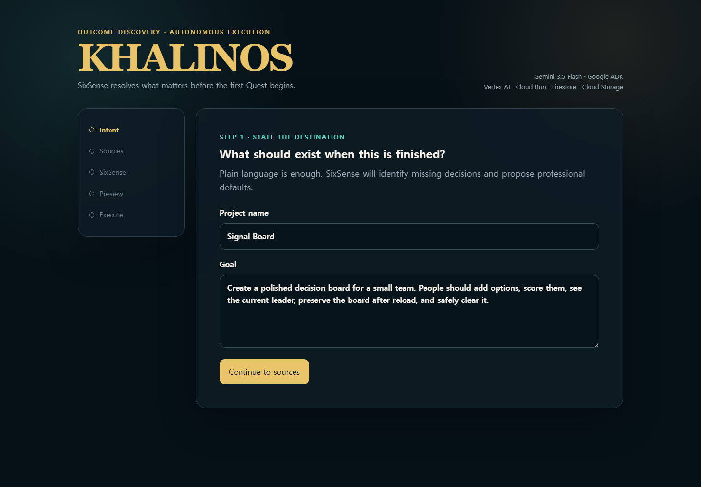
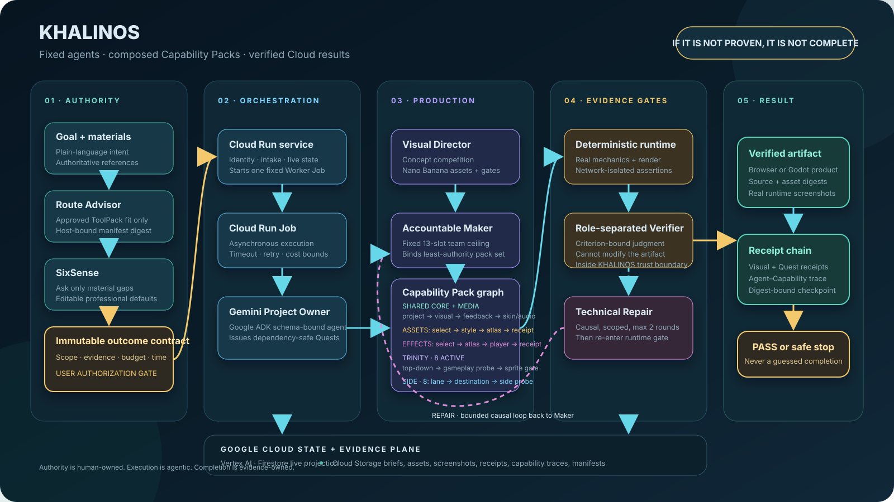
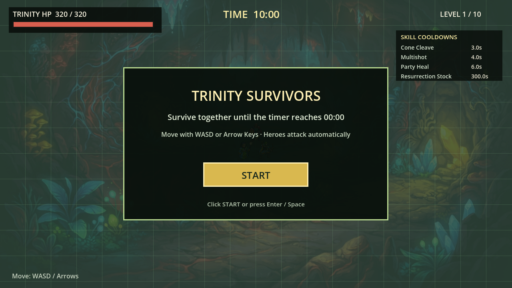
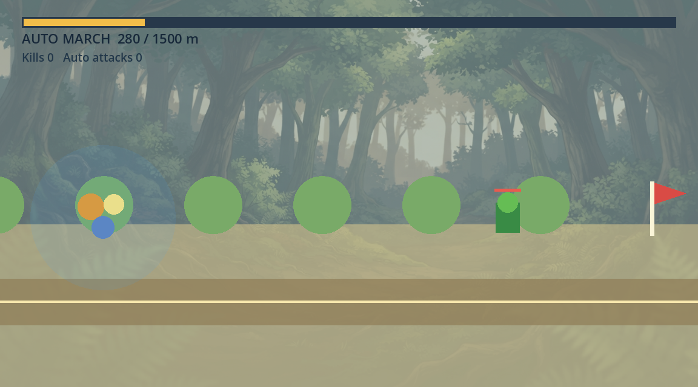
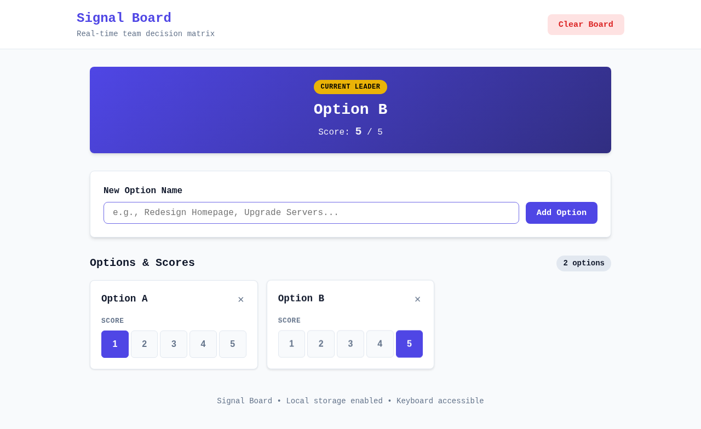
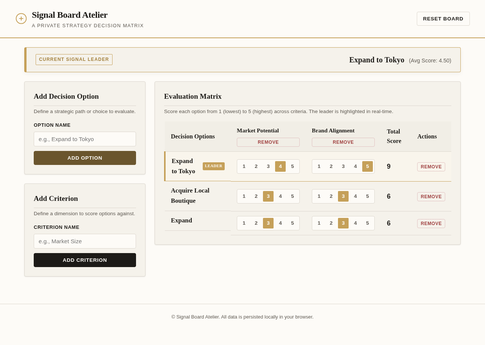
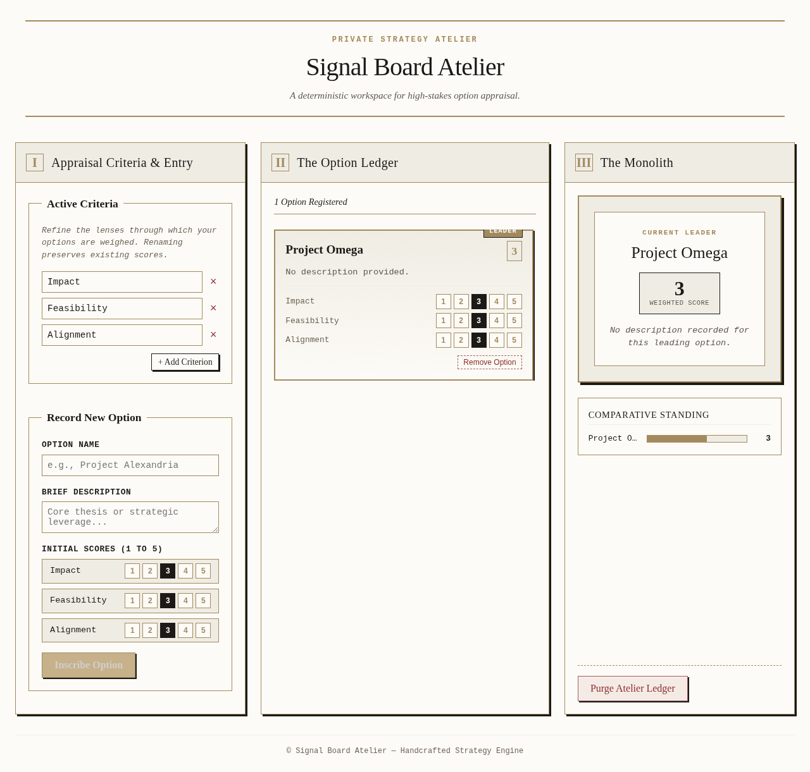
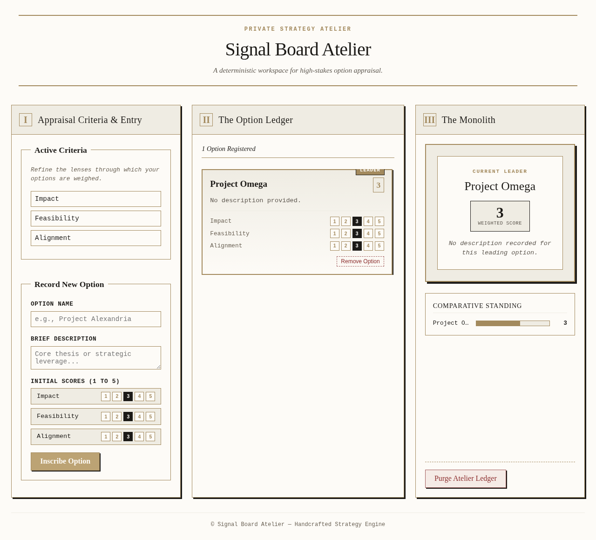
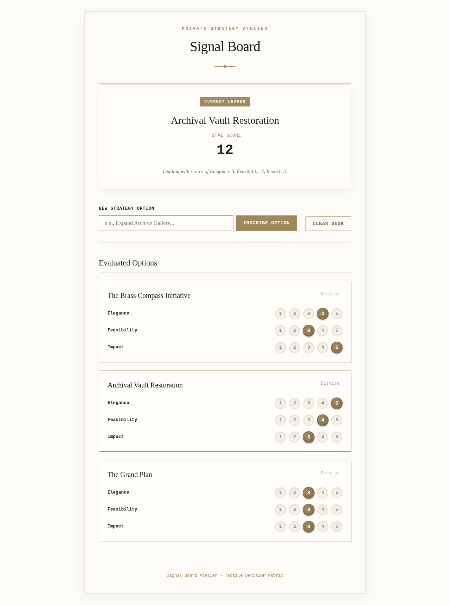

# KHALINOS

**KHALINOS is an evidence-gated autonomous production agent for bounded interactive prototypes: it turns a user's goal and authoritative materials into an immutable outcome contract, then plans, builds, runs, and verifies approved Browser or Godot outcomes on Google Cloud. Only results backed by real runtime evidence are marked complete.**

> If it is not proven, it is not complete.

KHALINOS is not a general-purpose coding chatbot and does not promise arbitrary repository completion. It separates authority, production, runtime verification, and judgment so the user does not become the hidden workflow engine. For a new project, a bounded Route Advisor compares the goal only with statically approved ToolPack manifests, explains exact fits, bounded alternatives, and incompatible routes, and waits for the user's confirmation. SixSense then inspects six project dimensions inside that selected capability boundary, asking only material unanswered questions. After authorization, a Gemini Project Owner issues an incremental Quest chain. Maker, deterministic Runtime Check, a separation-of-duties Verifier, and bounded Technical Repair remain separated by permissions and receipts. Browser products use multimodal visual selection. Godot work is composed from versioned Capability Packs: the verified top-down Trinity and side-scroll destination profiles share project, visual-foundation, and combat-feedback boundaries while retaining genre-specific mechanics and probes.

The public entrance separates a no-sign-in Judge Demo from private work. Google OpenID Connect uses only `openid`, `email`, and `profile`; the verified Google subject is the owner boundary for uploads, intakes, runs, and Project Library records. A passed run registers its artifact digest, immutable source ZIP snapshot, and receipt chain as the project's latest verified checkpoint. External browser projects enter through an owner-bound Cloud Storage resumable session and deterministic ZIP admission before SixSense can reference them.

This project targets the **Taskmaster** category of the All Things Agentic Hackathon.

## The friction

Long-running coding agents often fail in one of two ways: they improvise beyond the user's authority, or they repeatedly patch the latest symptom without preserving a verified state. Human supervision then becomes the real workflow engine.

KHALINOS replaces conversational handoffs with adaptive outcome discovery, an immutable approved brief, receipt-gated Quests, bounded repair, and a final evidence chain. After the user authorizes the Outcome Preview, the Cloud workflow completes or stops safely without a coding assistant designing, fixing, or approving intermediate work.

Once deployed, KHALINOS performs an approved run without Codex or another development assistant in the execution path. Extending KHALINOS itself—adding a new profile, changing a Capability Pack, fixing SixSense, or deploying a new release—remains ordinary product development and is not claimed as self-modification.

## SixSense outcome discovery

SixSense is not a fixed six-question survey. It always checks six dimensions but asks only when a missing choice could materially change feasibility, scope, visual direction, quality, authority, or cost:

1. Required enablers
2. Exclusions and preservation
3. Experience and visual direction
4. Operating context
5. Completion and quality standard
6. Authority, budget, and delivery

The user first supplies working material, then states the goal. Material may describe an existing project location, source folder structure, runnable build, or ordinary text and image references. KHALINOS classifies it statically without executing untrusted files. For a new project it next shows a Route recommendation: semantic fit is produced by Gemini, but the candidate set, compatibility filter, project kind, manifest digest, and final execution binding remain host-controlled. The user confirms one compatible route before SixSense begins. Each necessary SixSense question offers short, genuinely user-owned choices plus a free-form alternative; professional defaults remain KHALINOS decisions. When the six dimensions are sufficiently resolved, KHALINOS presents the expected final result, material mode, visual direction, boundaries, evidence standard, Quest estimate, cost, and duration. Execution begins only after explicit authorization. Choosing **Change route** discards the unresolved intake and returns to the goal; choosing **Revise outcome** keeps the confirmed route and carries the other confirmed decisions and sources into a fresh SixSense pass.

For judging, **Try Judge Demo** loads a bounded PUZZLE input-repair example without authentication or paid execution. **Choose a KHALINOS project**, persistent intake, run status, and authorization require a verified Google identity. When no OAuth Web Client ID is configured, the interface says so explicitly and leaves only the public Judge Demo available.



## Google technology

- **Gemini 3.5 Flash on Vertex AI** performs Project Owner, Visual Director, Visual Candidate Maker, multimodal Visual Verifier, Maker, separation-of-duties Quest Verifier, and Technical Repair decisions.
- **Nano Banana (`gemini-3.1-flash-lite-image`) on Vertex AI** generates one bounded environmental PNG per Browser or Godot visual concept. A separate multimodal gate inspects the raw image before any trusted compiler or rendered verifier can use it.
- **Google Agent Development Kit 2.6.2** runs every role as a schema-bound `LlmAgent`.
- **Cloud Run service** accepts an immutable brief and displays live status.
- **Cloud Run Job** performs the asynchronous long-running workflow.
- **Firestore** stores the current run projection.
- **Cloud Storage** stores immutable briefs, candidates, screenshots, Quest receipts, and the final manifest.
- **Cloud Storage resumable uploads** receive private project ZIP bytes without routing large archives through the API container.

## Architecture

[](docs/architecture/khalinos-architecture.svg)

The standalone diagram shows the full authority boundary, Gemini/ADK orchestration, fixed Agent–Capability bindings, the shared Godot Capability Pack graph, deterministic and separation-of-duties evidence gates, bounded repair loop, and Google Cloud state/evidence plane. A 1600×900 [PNG export](docs/architecture/khalinos-architecture.png) is included for the Devpost page and demo video.

## Safety and autonomy contract

- The user authorizes the selected ToolPack's exact bounded output surface and hard Quest/repair limits.
- External ZIP admission currently accepts only that exact bounded browser profile. Godot, Unity, executables, symlinks, encrypted entries, traversal paths, extra files, oversized text, and high-ratio archives are rejected before execution.
- The 30-minute setting is a per-execution runaway safety slice, not a general project deadline. The current browser micro-app profile is intentionally non-resumable, so an authorized run must fit one slice.
- Browser new-product visual selection requires at least two deterministically renderable candidates and records raw-asset gate receipts, asset digests, the concept plan, screenshots, rubric scores, selected artifact digest, and selection receipt.
- Godot visual-prototype selection has the same two-candidate minimum, but the host compiles every accepted PNG into bounded Godot scenes, imports the texture, proves scene loading and translucent composition, and captures three real 1280×720 frames through an isolated Xvfb display before multimodal selection.
- Godot gameplay composition validates pack dependencies before materialization. The Trinity profile owns top-down survival mechanics, profession progression, gameplay probe, and sprite atlas; the side-scroll profile owns lane combat, destination progression, and its genre probe. Both consume `godot.combat-feedback`, which owns only attack-line, attack-range, basic-attack, skill/heal, and enemy-attack drawing primitives.
- Every Godot Cloud result includes an Agent–Capability trace. The fixed ceiling remains 13 slots: Trinity activates 9 and side-scroll activates 8. The same accountable Maker slot consumes a different least-authority pack set for each profile; no new agent is invented to match a new genre.
- The model never emits binary asset fields. The trusted host validates and attaches exactly one `assets/visual-foundation.png` sidecar, while Makers receive only its path, digest, and dimensions.
- Image generation retries only transient 429/5xx responses, at most twice with backoff. Content rejection, invalid output, and non-transient client errors stop immediately.
- Generated Browser products cannot use external URLs, network calls, dynamic code loading, or files outside the five text files plus the one approved PNG. Prohibited external CSS imports are removed at the trusted promotion boundary before verification.
- Browser verification blocks every request except the local isolated product server.
- The Maker cannot approve its own work.
- The Verifier cannot modify the artifact.
- The Verifier is independent from the Maker by role, context, and write authority inside the KHALINOS trust boundary; it is not represented as an external audit organization.
- A transactional execution claim admits only one Worker for a queued run; duplicate or terminal dispatches are idempotent no-ops.
- A failed Quest receives at most two Technical Repair rounds and then stops as `blocked`.
- No previous PASS receipt is rewritten or silently weakened.

## Runtime evidence contract

Every active acceptance criterion must be exercised by its own browser journey and backed by at least one runtime assertion. The trusted verifier supports bounded waits, click/right-click/key input, deterministic random seeds, and assertions over text, element count, attributes, classes, and browser state. Criterion-bound text evidence must name a CSS selector, so unrelated page copy cannot create a false PASS. A criterion that requires execution evidence cannot pass from source inspection alone.

The Project Owner cannot promote verification files, logs, or implementation conveniences into new product requirements. Quest boundaries and objectives may be model-proposed, but the trusted host binds the immutable ordered acceptance criteria verbatim before execution. Verifier findings are bound back to the same criteria, so model wording drift cannot lose or broaden the user's contract.

The Browser visual-asset path passed an isolated production qualification on run `708ec62505e544ca85bbfa898343704b`. Two raw-gated candidates rendered successfully under network isolation; the independent Visual Verifier selected V2, and both Quest receipts preserved cumulative selector-bound runtime evidence. The qualified Browser ToolPack manifest SHA-256 is `162bd5734bdc4dab9810ce1e127b9110ec0400d30b36c7d83ea5d381009f2f8a`.

The separate Godot visual-prototype path passed isolated Cloud qualification on run `5ac8abad53dd4919bca5708557421c3c`. All three Nano Banana assets passed the strict no-text/no-glyph/no-interface gate, all three produced real 1280×720 Godot renders, the independent multimodal Visual Verifier selected V2, and two Quest receipts plus the final source ZIP were stored in Cloud Storage. The qualification used 12 model calls and completed in 2 minutes 7 seconds. The qualified `godot.visual-prototype` manifest SHA-256 is `de20c1d17ea546e69d6b40098f0c5c2acb9363a95a74aca9bb5fe8e08224286d`.

The composed Godot path passed two fresh Cloud qualifications on one Worker image, `sha256:615da3f80441c55e3eb0fca598db0abe8d44d1dd6ea6fd1b7815ce780797a24c`. Trinity run `78d1d06f2a034714b1d917ce6ce6f969` passed 45/45 deterministic mechanics, asset, sprite-atlas, pack-load, and display checks; the side-scroll run `fe2f3493c6af432e9ebd0b0c61852dcf` passed 18/18 horizontal movement, automatic combat, destination, pack-load, and display checks. Both had zero runtime issues and `cloud_workflow_execution` Agent–Capability traces. The comparison receipt is preserved in [`docs/evidence/capability-pack-composition/combat-feedback-cloud-qualification-20260821.json`](docs/evidence/capability-pack-composition/combat-feedback-cloud-qualification-20260821.json).

Live execution telemetry then passed a fresh side-scroll Cloud qualification on run `36dd87aa06bf43d49f3c819287b6a20b` / execution `khalinos-worker-vrv5n`. Persisted state moved the presented horse through Owner, Visual, Runtime, Maker, Verifier, and Result roles while milestone cargo advanced from M01 through M06. The run passed 18/18 deterministic checks with zero issues, 12 Gemini calls, and three receipts. The machine-readable qualification, including three causally corrected safe stops, is preserved in [`docs/evidence/capability-pack-composition/live-execution-telemetry-cloud-qualification-20260822.json`](docs/evidence/capability-pack-composition/live-execution-telemetry-cloud-qualification-20260822.json).

The authenticated delivery path was requalified after exposing the selected visual foundation in the side-scroll render. Run `43fbc45542f247f9a9081a956da89da7` / execution `khalinos-worker-prmm6` visibly advanced through the presented agents, candidates, and M01–M06 milestones, passed 18/18 runtime checks, and exposed the owner-bound source download action. Its exact Cloud and digest record is [`visual-foundation-cloud-qualification-20260822.json`](docs/evidence/capability-pack-composition/visual-foundation-cloud-qualification-20260822.json).

The current production API and Worker are deployed from the same SHA-verified Godot image so the UI, route contracts, and executable runtime cannot drift. The Worker uses 8 GiB memory, 2 CPU, a 1,800-second timeout, and zero automatic retries. An exact single ToolPack fit is bound before SixSense; the compatibility page appears only for unsupported or genuinely ambiguous decisions. Explicit New project inputs remain references and cannot silently convert the intake to existing-project work. The current composed Godot bindings are `godot.gameplay` 1.9.0 / `9339c4c3fdb2028c8b054f887d80190d844fba1add897893219d22ea206136da` and `godot.side-scroll-experiment` 0.4.0 / `b17c1fe5864b1c1cea828b588940761b6656bca69e24872a93474cf8b41e47d1`. Exact submission revision and digest evidence is recorded under [`docs/evidence/capability-pack-composition`](docs/evidence/capability-pack-composition).

## Local setup

Requirements: Python 3.12+, a local Chromium or Chrome executable, and Google Cloud Application Default Credentials with Vertex AI access.

```powershell
python -m venv .venv
.\.venv\Scripts\python.exe -m pip install -e ".[dev]"
$env:GOOGLE_GENAI_USE_VERTEXAI="TRUE"
$env:GOOGLE_CLOUD_PROJECT="YOUR_PROJECT_ID"
$env:GOOGLE_CLOUD_LOCATION="global"
$env:KHALINOS_CHROMIUM_PATH="C:\Program Files\Google\Chrome\Application\chrome.exe"
.\.venv\Scripts\python.exe -m pytest -q
```

The production API requires Firestore, a Cloud Storage bucket, and a fixed Cloud Run Job. For local workflow tests, the test suite uses an isolated filesystem store and fake role implementations; it never calls Vertex AI.

## Google Cloud deployment

Set a unique project and bucket name, then enable the required services:

```powershell
$env:KHALINOS_PROJECT="YOUR_PROJECT_ID"
$env:KHALINOS_REGION="asia-northeast3"
$env:KHALINOS_BUCKET="$env:KHALINOS_PROJECT-runs"
$env:KHALINOS_IMAGE="$env:KHALINOS_REGION-docker.pkg.dev/$env:KHALINOS_PROJECT/khalinos/worker:0.6.0-hackathon"

gcloud services enable run.googleapis.com cloudbuild.googleapis.com artifactregistry.googleapis.com aiplatform.googleapis.com firestore.googleapis.com storage.googleapis.com --project=$env:KHALINOS_PROJECT
gcloud artifacts repositories create khalinos --repository-format=docker --location=$env:KHALINOS_REGION --project=$env:KHALINOS_PROJECT
gcloud storage buckets create "gs://$env:KHALINOS_BUCKET" --project=$env:KHALINOS_PROJECT --location=$env:KHALINOS_REGION --uniform-bucket-level-access
gcloud storage buckets update "gs://$env:KHALINOS_BUCKET" --cors-file=deploy/storage-cors.json
gcloud firestore databases create --project=$env:KHALINOS_PROJECT --location=$env:KHALINOS_REGION --type=firestore-native
```

Create separate service identities:

```powershell
gcloud iam service-accounts create khalinos-api --project=$env:KHALINOS_PROJECT
gcloud iam service-accounts create khalinos-worker --project=$env:KHALINOS_PROJECT

$api="khalinos-api@$env:KHALINOS_PROJECT.iam.gserviceaccount.com"
$worker="khalinos-worker@$env:KHALINOS_PROJECT.iam.gserviceaccount.com"

gcloud projects add-iam-policy-binding $env:KHALINOS_PROJECT --member="serviceAccount:$api" --role="roles/datastore.user"
gcloud projects add-iam-policy-binding $env:KHALINOS_PROJECT --member="serviceAccount:$api" --role="roles/storage.objectAdmin"
gcloud projects add-iam-policy-binding $env:KHALINOS_PROJECT --member="serviceAccount:$api" --role="roles/run.developer"
gcloud projects add-iam-policy-binding $env:KHALINOS_PROJECT --member="serviceAccount:$api" --role="roles/aiplatform.user"
gcloud projects add-iam-policy-binding $env:KHALINOS_PROJECT --member="serviceAccount:$worker" --role="roles/datastore.user"
gcloud projects add-iam-policy-binding $env:KHALINOS_PROJECT --member="serviceAccount:$worker" --role="roles/storage.objectAdmin"
gcloud projects add-iam-policy-binding $env:KHALINOS_PROJECT --member="serviceAccount:$worker" --role="roles/aiplatform.user"
```

Build and deploy:

```powershell
gcloud builds submit --project=$env:KHALINOS_PROJECT --config=cloudbuild.godot.yaml --substitutions="_IMAGE=$env:KHALINOS_IMAGE"

gcloud run jobs deploy khalinos-worker --project=$env:KHALINOS_PROJECT --region=$env:KHALINOS_REGION --image=$env:KHALINOS_IMAGE --service-account=$worker --command=python --args="-m" --args="khalinos.worker" --set-env-vars="GOOGLE_CLOUD_PROJECT=$env:KHALINOS_PROJECT,GOOGLE_CLOUD_LOCATION=global,GOOGLE_GENAI_USE_VERTEXAI=TRUE,KHALINOS_BUCKET=$env:KHALINOS_BUCKET,KHALINOS_MODEL=gemini-3.5-flash" --task-timeout=1800 --max-retries=0 --memory=8Gi --cpu=2

gcloud run deploy khalinos --project=$env:KHALINOS_PROJECT --region=$env:KHALINOS_REGION --image=$env:KHALINOS_IMAGE --service-account=$api --set-env-vars="GOOGLE_CLOUD_PROJECT=$env:KHALINOS_PROJECT,KHALINOS_REGION=$env:KHALINOS_REGION,KHALINOS_BUCKET=$env:KHALINOS_BUCKET,KHALINOS_WORKER_JOB=khalinos-worker,KHALINOS_MODEL=gemini-3.5-flash,KHALINOS_PUBLIC_ORIGIN=https://YOUR_CLOUD_RUN_HOST" --min=0 --max=2 --memory=512Mi --cpu=1 --allow-unauthenticated
```

Create an External Google OAuth Web client for the deployed HTTPS origin and set its client ID on the API service. Request basic identity only; do not request Drive or `cloud-platform` scopes.

```powershell
gcloud run services update khalinos --project=$env:KHALINOS_PROJECT --region=$env:KHALINOS_REGION --update-env-vars="KHALINOS_GOOGLE_CLIENT_ID=YOUR_WEB_CLIENT_ID.apps.googleusercontent.com"
```

The service remains publicly reachable so the Judge Demo and landing page load, but every private API validates the Google ID token and checks the stored `owner_id`. The Worker needs no end-user token; it receives only an immutable run ID and writes the verified checkpoint to the already owner-bound project record. A passed Browser result can be played in an isolated browser tab, and every passed Browser or Godot project exposes an owner-bound **Download verified source** action.

Grant the API identity permission to run the fixed worker Job and act as its identity using the narrowest organization policy available. Verify the deployed `/health` response, submit one brief through the UI, and observe the Cloud Run execution, Vertex AI calls, Firestore state changes, Cloud Storage evidence, and final receipt chain.

## Reproducible proof checklist

1. Show the public Cloud Run URL and `/health` response.
2. Submit one brief and do not edit the run afterward.
3. Show the asynchronous Cloud Run Job execution.
4. Show Vertex AI/Cloud logs for the four ADK roles.
5. Show Firestore advancing through planning, execution, verification, and repair if needed.
6. Show Cloud Storage screenshots and every Quest receipt.
7. Open the final generated application and its final manifest.

## Trinity Survivors: verified Godot proof

Trinity Survivors is a proof output, not KHALINOS's product boundary. The current bounded `godot.gameplay` ToolPack converted one immutable game brief into a playable Godot 4.7 vertical slice, executed its real mechanics and display runtimes, and completed only after deterministic checks and the role-separated Verifier passed. The Verifier is separated from planning and making inside KHALINOS; this is not a claim of an external audit organization.

- Run ID: `78d1d06f2a034714b1d917ce6ce6f969`
- Result: `PASS` — `Godot gameplay vertical slice passed real mechanics, rendering, and independent verification.`
- Cloud deployment: project `khalinos-agent-20260818`, region `asia-northeast3`, Job `khalinos-worker`, execution `khalinos-worker-x74vs`
- Worker image: `sha256:615da3f80441c55e3eb0fca598db0abe8d44d1dd6ea6fd1b7815ce780797a24c`
- ToolPack: `godot.gameplay` 1.9.0, manifest SHA-256 `6c2ff6753c93ac8edcb0d4d7afb01b3ca1d9bdd3a6f9f48292ebfa25336397fb`
- Agent work: 18 Gemini calls; three immutable receipts (one Visual Selection and two Quest receipts)
- Runtime proof: 45 deterministic Godot mechanics, asset, sprite-atlas, shared-pack, and display checks passed; Sprite Gate passed; zero issues
- Artifact SHA-256: `34116f1e4e6ee140e0287e152ac6572cb2638feef4a062c7260952e0d46ce482`
- Bundle SHA-256: `828373b72792c5f2f17fe9ea9bb8b043ecf6ef56d3db1d2ae9dc779311bb6a0e`
- Source ZIP SHA-256: `160ee614bfefa686830d708ef74876b59ac5bacadfc53c9c324c78a4ccbcf00c`
- Sprite atlas SHA-256: `a4a9fbcea5d6f94f417651b41c33d53a798282428e1297189198df09ce38cf56`
- Agent–Capability trace SHA-256: `71b566334c17d8ac8cda873c1a1f5eacfab75301cc8060408e2f9180ede5967a`



The frame above is the retained render from the earlier `8be19784...` evidence set, not a screenshot attributed to the latest run. The latest two-profile qualification is recorded by the digest-bound comparison receipt linked above.

The immutable brief, Quest plan, Visual Selection receipt, three Quest receipts, final artifact manifest, Sprite Gate result, deterministic evidence, raw Godot probe receipt, and rendered frame are preserved in [`docs/evidence/trinity-survivors`](docs/evidence/trinity-survivors).

### Measured execution utility

These are direct log and artifact measurements, not estimated labor or cost savings.

| Measure | Observed value |
| --- | ---: |
| Human interventions after immutable authorization | 0 |
| Cloud Run Job duration | 8m 4.87s |
| Gemini calls | 18 |
| Generated source files | 10 |
| Deterministic checks | 45/45 PASS |
| Role-separated receipts | 3 |
| Technical Repair rounds | 0 |
| Final runtime issues | 0 |

The evidence proves a bounded vertical slice with executable mechanics, rendering, and receipt-gated verification. It does not prove general-purpose repository autonomy, production-scale reliability, external organizational independence, or polished commercial game quality. The single retained display capture is a real runtime frame, but the temporal mechanics are proven by the typed Godot probe rather than by claiming that one screenshot shows every state. The failure-and-recovery ledger is preserved beside the run evidence.

## Side-scroll destination: verified composition proof

The experimental side-scroll profile reuses the same project, visual-foundation, and combat-feedback boundaries while replacing Trinity's genre chain with lane combat, destination progression, and a side-scroll probe. This is evidence that fixed KHALINOS agent slots can consume different compatible pack combinations; it is not a claim that arbitrary game genres are already supported.

- Run ID: `43fbc45542f247f9a9081a956da89da7`
- Result: `PASS` — `Godot side-scroll journey passed real mechanics, rendering, and independent verification.`
- Cloud Run Job execution: `khalinos-worker-prmm6`, completed in 2m 38.47s
- Qualified image: `sha256:e4878ec25980adadabff6317af192e7f94e8a476200d4007d69e1821c0df2c09`
- ToolPack: `godot.side-scroll-experiment` 0.4.0, manifest SHA-256 `500e0d1621da4d8dfae6cb48198b0ad91b1702d13025f636389078d55cdd83d4`
- Agent work: 12 Gemini calls; three immutable receipts
- Runtime proof: 18/18 deterministic mechanics, pack-load, and display checks passed; zero issues
- Artifact SHA-256: `6821c108df25784ee74113a6909bf21825c6353d3b814528ac609102962f362c`
- Bundle SHA-256: `d6925585c65fa33ff75844438f513043bed491461599e2141fbc7562e9749ab9`
- Source ZIP SHA-256: `57ffd1c51a620940f4aeca4d72233ddd7c01c571d83084d9931a1524a4083cde`
- Agent–Capability trace SHA-256: `b0ed27a8705b64294ff705b844e868739d215abdee76bc74b2140b10b70324b3`
- Live presentation proof: the authenticated Chrome UI showed `Cloud Run Service → Gemini Project Owner → Deterministic Runtime V1/V2/V3 → Verified Result`; M01–M06 were all complete at PASS and the owner-bound source download action was visible



The layer correction makes the generated foundations visible, and the Visual Verifier distinguished V1's forest, V2's mountain/celestial direction, and V3's misty woodland direction. The honest boundary remains: characters, enemies, and typography are prototype-level geometric presentation, not polished custom pixel art. The PASS proves mechanics, rendering, destination victory, receipt-gated verification, and truthful live telemetry—not commercial game polish.

| Profile | Active fixed slots | Accountable Maker packs | Genre-specific verifier |
| --- | ---: | --- | --- |
| Trinity top-down | 9 | `project-core`, `top-down-auto-combat`, `combat-feedback` | `gameplay-probe` plus Sprite Gate |
| Side-scroll destination | 8 | `project-core`, `side-scroll-lane-combat`, `combat-feedback`, `destination-progression` | `side-scroll-probe` |

The fixed ceiling is 13 agent slots and `new_agent_slots_created` is false. The role-separated Verifiers remain inside the KHALINOS trust boundary; deterministic Godot probes and digest-bound evidence compensate for, but do not turn them into, external organizational audits.

## Earlier verified Browser proof

The repository includes evidence from a fresh autonomous run made after deployment:

- Run ID: `5fc00dc96e0a41cd8df713c58eb06678`
- Immutable brief SHA-256: `86c29a41b04fcdbaec6aa3452f3ccd0b5a361e9346a83915b09ee4b6a9fc95d8`
- Worker image digest: `sha256:89f47eecede50ac291aa96d7c272d7652a85eedb960d05336d49afcf72cbf429`
- Result: 3 of 3 receipt-gated Quests passed, 0 repair rounds, 7 Gemini calls
- Cloud Run Job execution: `khalinos-worker-7nwtm`, completed successfully in 2m 4.72s



The machine-readable Quest plan, receipts, and final manifest are in [`docs/evidence`](docs/evidence). The live service is [KHALINOS on Cloud Run](https://khalinos-lnvkyx4gca-du.a.run.app).

### SixSense visual-contract proof

A second fresh run tested whether a detailed SixSense visual contract changes the generated result without human or coding-assistant intervention after authorization:

- Intake ID: `d1ca99ad93404e8390e53a0cad367a43`
- Run ID: `1a88eddcb56f45648bd4e51716284ee4`
- Immutable brief SHA-256: `a49bb41248383b8418f143471e4135027f918987a74bfe3997331f4880da1e6e`
- Worker image digest: `sha256:0d73aba5561cd50e5ab9773682dc70d01bf17a3c35185a4e2c6290b48d580e99`
- Result: 3 of 3 Quests passed, 0 repair rounds, 7 Gemini execution calls
- Cloud Run Job execution: `khalinos-worker-dtp9v`, completed successfully in 2m 16.49s
- Visual contract: warm parchment, charcoal ink, restrained brass, editorial hierarchy, tactile depth, and explicit rejection of generic admin-dashboard styling

| Baseline brief | SixSense visual contract |
| --- | --- |
|  |  |

The second run's machine-readable brief, Quest plan, receipts, and final manifest are in [`docs/evidence/sixsense-run`](docs/evidence/sixsense-run).

### Multimodal visual-selection proof

A third fresh run reused the same Signal Board Atelier user goal to test visual competition rather than a different prompt. KHALINOS generated three structural concepts, rendered each in isolated Chromium, admitted the two candidates that passed deterministic checks, and asked an independent multimodal Visual Verifier to score only their screenshots. V2 won with a 9.2 rubric average over V3's 9.0, and its artifact digest became the parent of Q1.

- Intake ID: `9b9cb169a5cf498390de03c55624945c`
- Run ID: `683ae8d01f2143d89b57ac53f9bbc8de`
- Immutable brief SHA-256: `c153b1f0b2da9ecf24653a74356dcb1577b7b0a48f97e423eabce0dac228df68`
- Worker image digest: `sha256:52c1714dca706190b81e5e894fc485c41cb214cde21624a246b4fedda351e22e`
- Visual receipt: `VS-36570c0819ff47a9`, selected `V2` from eligible `V2` and `V3`
- Result: visual selection plus 3 of 3 receipt-gated Quests passed, 0 repair rounds, 12 Gemini execution calls
- Cloud Run Job execution: `khalinos-worker-rnv7l`, completed successfully in 5m 56.56s

| Earlier single-generation result | Visual-selected final result |
| --- | --- |
|  |  |

| Eligible V2 | Eligible V3 |
| --- | --- |
|  |  |

The concept plan, rendered screenshots, selection receipt, Quest receipts, immutable brief, and final manifest are in [`docs/evidence/visual-selection-run`](docs/evidence/visual-selection-run).

## Hackathon alignment

KHALINOS follows the [official rules](https://allthingsagentichackathon.devpost.com/rules) and [official resources](https://allthingsagentichackathon.devpost.com/resources): it uses Gemini 3.5 Flash through Vertex AI, Google ADK as its agent framework, and four Google Cloud services. It is entered as a **Taskmaster** because one user brief triggers a complete asynchronous workflow without step-by-step human guidance.

## Development disclosure

KHALINOS was created during the contest period. AI coding tools assisted implementation and debugging during product development. They are not part of the demonstrated autonomous run after the user submits the brief. The submitted proof run must be a fresh Cloud execution in which KHALINOS itself performs planning, creation, verification, repair, and completion.
